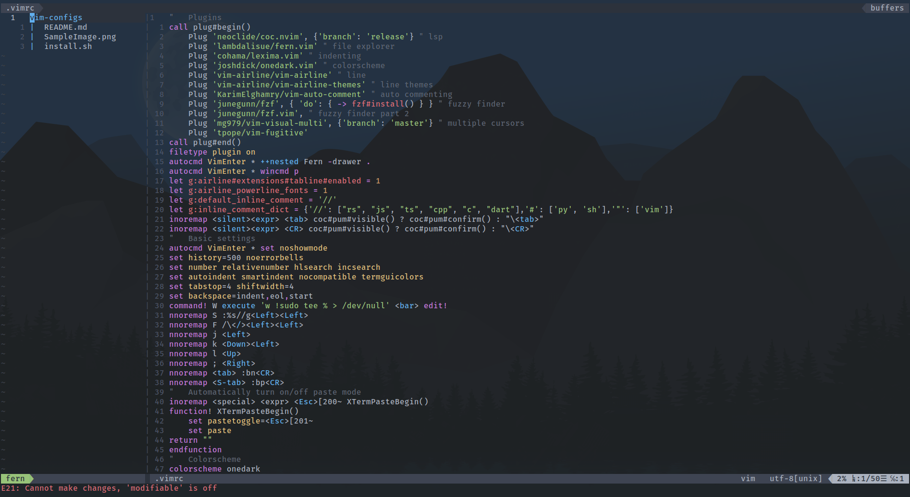

Extremely lightweight vimrc (only 50 lines)

Features include:
* File explorer
* LSP support
* Autocomplete
* Statusbar
* Comment lines hotkey
* Fuzzy find
* Multi-line editing
* Git commands

# Sample Image


# How to Install
Install Vim, [Nodejs](https://nodejs.org/en/), [fzf](https://github.com/junegunn/fzf) and [The Silver Searcher](https://github.com/ggreer/the_silver_searcher)
```sh
pacman -S vim nodejs fzf the_silver_searcher
```
Install the config ([What you are running](https://raw.githubusercontent.com/Xyverle/vim-configs/main/install.sh))
```sh
curl -N https://raw.githubusercontent.com/Xyverle/vim-configs/main/install.sh|bash
```
# Vim Language Server
If you want autocompletion see

https://github.com/neoclide/coc.nvim/wiki/Using-coc-extensions#implemented-coc-extensions
